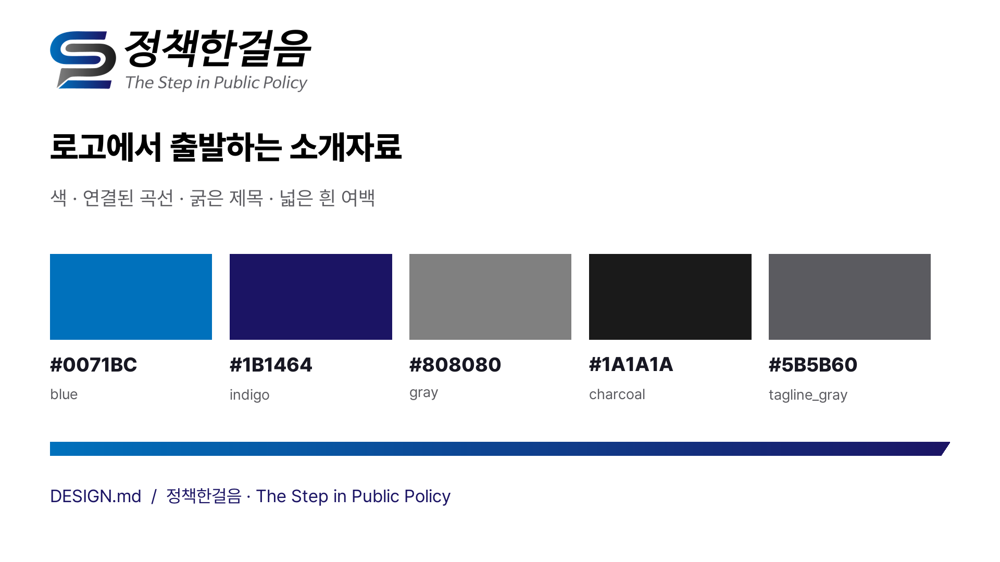

# 정책한걸음 — 소개자료 디자인 기준

2026-10-10 · 적용 범위: README 소개 이미지, 30초 모션그래픽, GIF, 포스터.

사용자가 제공한 **정책한걸음 최종 로고**에서 색·형태·문자 특성을 확인하고, 소개자료에 필요한 배치·타이포그래피·모션 규칙을 확장한 문서입니다. 원본에서 확인한 값과 이번 제작에서 정한 규칙을 구분합니다. 기존의 공식 브랜드 매뉴얼을 전재한 문서는 아닙니다.

## 1. 기준 원본

- `정책한걸음_최종 로고_원본 파일.ai`: 벡터 경로와 그라데이션 정의를 확인한 기준 파일.
- `SP2_최종 로고 이미지.png`: 영상에 실제로 배치하는 투명 PNG. [저장소 내 원본 사본](docs/media/brand-logo.png)
- 같은 이름의 JPG는 흰 배경 확인용입니다. 영상에는 투명 PNG를 사용합니다.
- 원본 체크섬과 기계 판독용 값: [brand-tokens.json](docs/media/brand-tokens.json)

데스크톱 원본은 변경하지 않습니다. PNG 사본은 바이트 단위로 동일하게 보관합니다. 배치할 때만 투명 바깥 여백을 제외해 크기를 맞추며 심벌·워드마크·태그라인의 내부 비례는 바꾸지 않습니다.

## 2. 로고에서 확인한 시각 특성

| 요소 | 확인 내용 | 소개자료에 적용하는 방식 |
|---|---|---|
| 파란 심벌 | 밝은 파랑에서 짙은 남색으로 이어지는 선형 그라데이션 | 연결선·진행 표시·중요한 결과에 사용 |
| 회색 심벌 | 중간 회색에서 짙은 회색으로 이어짐 | 원문·입력·중간 상태를 표현 |
| 연결된 곡선 | 둥근 방향 전환과 이어지는 두 줄 | 입력에서 결과로 이어지는 경로 애니메이션 |
| 전진하는 형태 | 오른쪽으로 기울어진 문자와 비스듬한 끝단 | 장식 띠의 끝단에만 제한적으로 반영 |
| 한글 워드마크 | 굵은 검정, 높은 밀도와 강한 실루엣 | 본문 제목의 굵기·대비를 결정하는 참고 |
| 영문 태그라인 | 회색 이탤릭, `The Step in Public Policy` | 원본 로고의 일부로 유지 |
| 넓은 여백 | 흰 바탕 위 심벌·문자의 명확한 대비 | 화면을 흰색 중심으로 구성 |

AI 파일의 로고 문자는 윤곽선 경로입니다. **원래 폰트명은 확인할 수 없습니다.** 비슷한 폰트로 로고를 다시 조판하지 않고 원본 이미지를 배치합니다.

## 3. 색상

아래 주색·보조색은 원본 AI의 RGB 그라데이션과 벡터 채움에서 확인했습니다. RGB 실수값을 8비트 HEX로 변환한 값입니다.

| 토큰 | HEX | 근거·용도 |
|---|---|---|
| `blue` | `#0071BC` | 파란 심벌 시작색. 주요 연결·강조 |
| `indigo` | `#1B1464` | 파란 심벌 끝색. 제목·완료 상태 |
| `gray` | `#808080` | 회색 심벌 시작색. 입력·중간 상태 |
| `charcoal` | `#1A1A1A` | 회색 심벌 끝색. 본문·구조 |
| `black` | `#000000` | 한글 워드마크 |
| `tagline_gray` | `#5B5B60` | 태그라인의 채움색을 반올림한 값 |
| `white` | `#FFFFFF` | 화면 배경 |

다음은 원본 로고에 있는 색이라고 주장하지 않는 **화면용 파생색**입니다.

| 토큰 | HEX | 용도 |
|---|---|---|
| `ink` | `#171722` | 일반 제목·본문 |
| `muted` | `#5B5B60` | 보조 설명 |
| `line` | `#D9DFEA` | 구분선·대기 상태 |
| `pale` | `#EEF5FB` | 선택 영역·결과 패널 |

파랑→남색 그라데이션은 연결과 전진을 나타내는 띠·경로에만 사용합니다. 긴 문장에는 단색을 사용합니다. 세 레포를 같은 브랜드로 묶고 제품 구분은 이름·내용으로 합니다.

## 4. 로고 배치

- 매 장면의 왼쪽 위에 원본 로고를 같은 크기로 배치합니다.
- 로고 주변에는 심벌 높이의 1/4 이상 여백을 둡니다. 이는 이번 소개자료에서 정한 보호 여백입니다.
- 로고는 흰 바탕에 놓습니다. 어두운 장면에서도 로고 영역은 흰색을 유지합니다.
- 워드마크·태그라인을 삭제하거나 따로 움직이지 않습니다. 늘이기, 기울이기, 재색칠, 외곽선·그림자 추가를 하지 않습니다.
- 제품 이름이 회사 이름을 대체하지 않도록 회사 로고와 레포 이름을 분리합니다.

## 5. 설명용 타이포그래피

설명 자막에는 Pretendard를 사용합니다. 원본 로고 서체를 특정한 결과가 아니라 한국어 가독성을 위한 별도 선택입니다.

| 역할 | 1920×1080 기준 | 굵기 |
|---|---|---|
| 도입 핵심 문장 | 약 76–84px | ExtraBold 또는 Bold |
| 장면 제목 | 약 58–66px | Bold |
| 핵심 결과·전후 문구 | 약 42–54px | Bold |
| 설명·사용 요청 | 약 32–40px | Regular / Medium |
| 조건·범위 설명 | 24px 이상 | Regular |

본문은 정자로 쓰고 기울이지 않습니다. 한 화면의 헤드 메시지는 1개, 주요 강조는 1–2개로 제한합니다. 긴 코드·설치 명령은 README에서 읽게 하고 영상에는 첫 행동을 남깁니다.

## 6. 배치와 그래픽

- 16:9, 1920×1080. 좌우 안전 여백 96px, 상단 고정 로고 영역.
- 흰 배경, 검정에 가까운 제목, 파란 경로를 기본으로 합니다.
- 단계는 회색 대기 → 파란 진행 → 남색 결과 순서로 읽힙니다. 숫자·제목도 병기합니다.
- 입력은 왼쪽, 결과는 오른쪽. 연결선을 따라 시선과 요소가 이동합니다.
- 보조 그래픽은 원본의 곡선·비스듬한 끝단에서 유도한 경로와 띠입니다. 심벌 자체를 임의로 다시 그린 대체 로고로 쓰지 않습니다.
- 문서 조각·치환·검수 기록처럼 기능을 설명하는 요소만 움직입니다. 불필요한 입체 효과, 장식 아이콘, 그림자 카드의 반복은 피합니다.

## 7. 모션

30초, 30fps, 무음·화면 자막. 아래 시간은 영상 구성일 뿐 도구 실행시간이 아닙니다.

| 구간 | 역할 | 움직임 |
|---|---|---|
| 0–4초 | 업무 문제와 제품 이름 | 연결 곡선을 따라 요소가 도착, 핵심 문장 등장 |
| 4–11초 | 입력과 요청 | 입력이 하나씩 놓이고 요청으로 경로 연결 |
| 11–20초 | 처리·결과 | 단계별 경로 점등, 교정·가명화·검수의 실제 의미 시각화 |
| 20–26초 | 강점 | 번호와 강점이 일정한 박자로 등장 |
| 26–30초 | 첫 행동·레포 주소 | 로고와 제품 이름을 유지하고 시작 방법에 시선 집중 |

등장·이동은 대체로 0.45–0.7초의 ease-out, 장면 전환은 약 0.3초의 짧은 연결로 구성합니다. 반짝임·회전·무작위 흔들림은 사용하지 않습니다. 원본 로고는 내부 요소를 분해하지 않고 한 덩어리로 배치합니다.

## 8. 적용과 검증

- 공통 토큰: [docs/media/brand-tokens.json](docs/media/brand-tokens.json)
- 제품별 내용: [docs/media/intro.json](docs/media/intro.json)
- 재생성: `python3 docs/media/render_intro.py`
- 산출물: MP4, README GIF, 정지 포스터, 장면별 스토리보드.
- 무음으로도 입력·처리·결과와 강점을 이해할 수 있는지 확인합니다.
- 1080p 원본과 README 축소 화면에서 로고·한글·범위 안내의 잘림과 겹침을 확인합니다.
- 원본 PNG 체크섬, 30초·900프레임, 전체 영상 디코딩, README 링크를 확인합니다.

기능 설명의 근거와 실행 확인 범위는 [영상 문서](docs/media/README.md)에 별도로 남깁니다.
