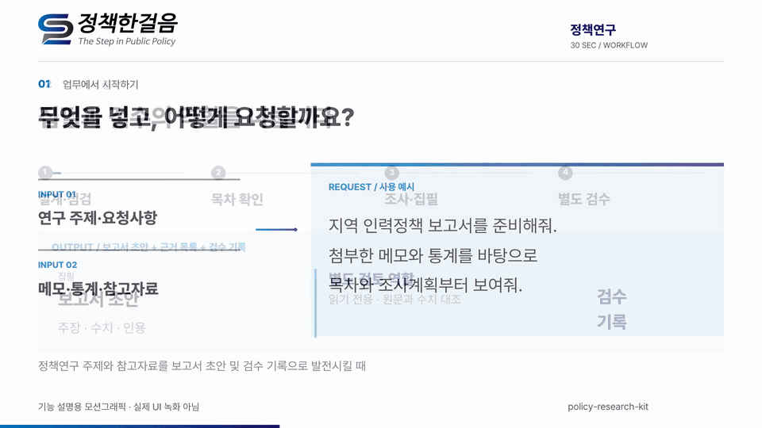

# policy-research-kit

[](CHANGELOG.md)
[](LICENSE)


[한국어](README.md) · **English**

**A [Claude Code](https://claude.com/claude-code) plugin that connects policy research planning, evidence gathering, drafting, and review, with records you can revisit.**

Start with a topic and your available material. Five agent roles divide the work, including a separate, read-only reviewer that checks the design and draft. Markdown is the baseline output; Korean `.hwpx` export requires a separate conversion tool.

## 30-second introduction (Korean)

[](docs/media/intro.mp4)

This video reconstructs a Claude Code conversation and example output files; it is not a live session recording. Try the [fictional starting prompt](examples/intro-request.md) after installation. Start by confirming the research question, outline, and evidence plan, then inspect the evidence list and review record as the draft develops. Review reduces some risks but does not guarantee accuracy.

## A concrete workflow

For a local AI workforce policy report, attach your notes and ask: “Compare training support with specialist placement. Show me the outline and evidence plan first.” Adjust the proposed outline, then proceed with research and drafting.

Read `_workspace/04_report_draft.md` alongside `03_evidence.md` and `05_draft_review.md`. For example, a claim that training is “most effective” without comparable evidence should receive a review note identifying its location, the missing evidence, and a proposed correction. This is an illustrative case, not a finding about policy effectiveness.

## What makes it different

Working source links alone do not establish that the cited documents support a report's numbers. This plugin makes that comparison part of the workflow and leaves a review record.

So I measured it. I gave the same topic to plain Claude Code and to this plugin, then had a neutral third party **open all 14 cited links** from both and compare them against the originals.

| | Plain Claude Code | This plugin |
|---|---|---|
| Did it actually open its sources? | Never opened one | Opened every key figure |
| Wrong numbers or wrong attribution | **2** (all stated as fact) | **0** (unconfirmed ones marked "needs checking") |
| Did the work leave a trail? | No | 5 files |

In this one comparison, **the plain Claude Code draft was judged smoother to read.** It also contained two wrong numbers and left no evidence-checking record. This single case does not establish a general performance difference across topics or runs.

→ [Full comparison](docs/vanilla-vs-kit.md) · [Why I built this, and fuller usage notes](docs/why.md) · [Strengths at a glance & what to connect](docs/strengths.md) (Korean, with English TL;DR)

## How it runs

```
Outline → 🚦Check 1 → ★You confirm the outline → Research → Writing → 🚦Check 2 → Korean file
```

It **stops twice.** The first stop catches a bad outline — once 50 pages exist against the wrong structure, there's no cheap way back, so it checks before writing. The second stop reviews the finished draft, because polished writing is hard to doubt on your own. That review is done by **a different AI that didn't write anything**, in read-only mode.

Things these checks have actually caught: 3 sources that didn't exist, a figure converted 10× off, an overall average written as if it applied to one specific group, and a research question claiming more than the evidence could support.

## Install

```
/plugin marketplace add parkjui92/policy-research-kit
/plugin install policy-research-kit@policy-research-kit
```

## Using it

Just ask in plain language.

```
Write a policy report on regional depopulation. Notes attached.   ← 50+ pages
Just a quick 4-page policy brief on this.                         ← short version
Review this 200-page report and shore up the weak sourcing.       ← fixing an existing one
Make chapter 3 center on international cases                      ← at the outline step
```

That last one matters: when it shows you the outline, asking for changes rebuilds it right there. **It's the cheapest moment to change direction.**

## What you end up with

Not just a finished report — **the whole process stays on disk as files.**

The outline, what the first check flagged and why, a list of which fact came from which source, the draft, what the second check found and what was actually changed, and the final Korean file.

Which means that months later, when someone asks where a number came from, you can answer.

## Good to know

- Producing the Korean `.hwpx` file needs a separate converter called [kordoc](https://github.com/chrisryugj/kordoc). Without it everything still runs and you get Markdown.
- A standard report **takes real time** — research and verification are the slow part. In a hurry, just say so ("make it quick"): research splits into parallel runs and revision loops shrink. If a stage runs far past its time budget, it shows you what's finished so far and asks how to proceed. Mechanical steps like file conversion run on a lighter, faster model from the start — but **the reviewing AI is never downgraded.**
- **The checks reduce errors but don't eliminate them.** The reviewing AI comes from the same model family and can share the same blind spots. A person still needs to look.
- The comparison above was **one topic, run once**. Treat it as a case you can reproduce, not a proven statistic.
- It's shaped around Korean policy-research practice (HWPX submissions, Korean-language sources).
- [If setup gives you trouble](docs/runtime-notes.md) · [Building this kind of review structure yourself](docs/verification-gates.md)

## Related work


My other tools, mapped by research stage, are on [my profile](https://github.com/parkjui92).

## License

[MIT](LICENSE). Contains no organization-specific templates and no real client deliverables.
